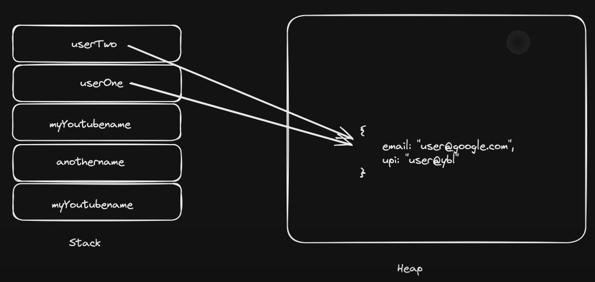

# Stack and Heap memory in Javascript

+ ## Stack (Returns Copy)
1. Primitive

```
let myYouTubeName = "Sanket Bunty"
let anotherName = myYouTubeName
anotherName = "creativeIndex"

console.log(myYouTubeName) // prints: Sanket Bunty
console.log(anotherName) // prints: creativeIndex

```

+ ## Heap (Return reference)
1. Non-Primitive

```
let userOne = {
    email : "user@google.com"
    upi : "user@ybl"
}

let userTwo = userOne

userTwo.upi = sanket@okhdfcbank

console.log(userTwo.upi) // prints: sanket@okhdfcbank
console.log(userOne.upi) // prints: sanket@okhdfcbank

```

---



---